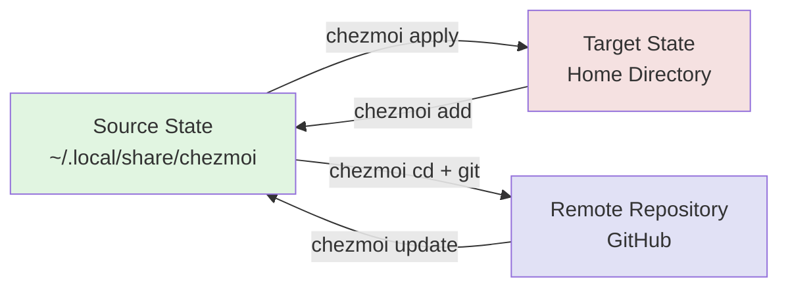
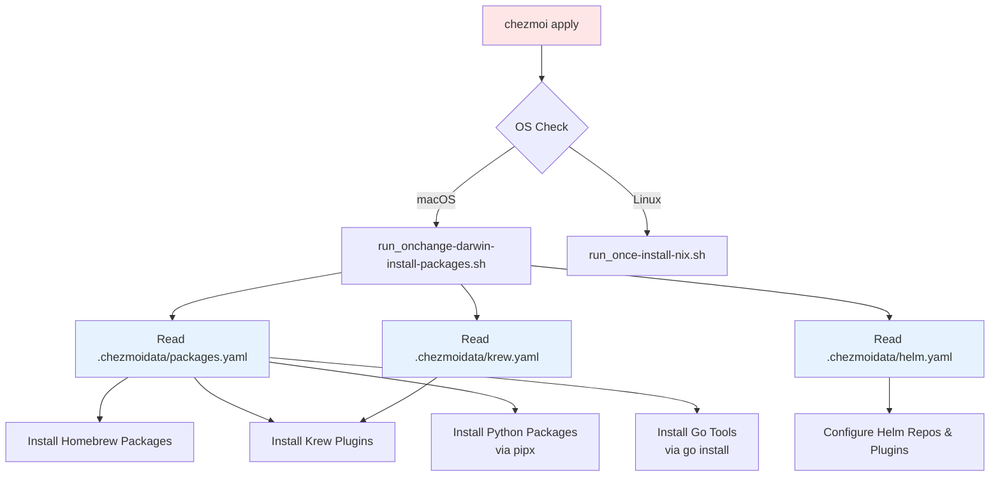
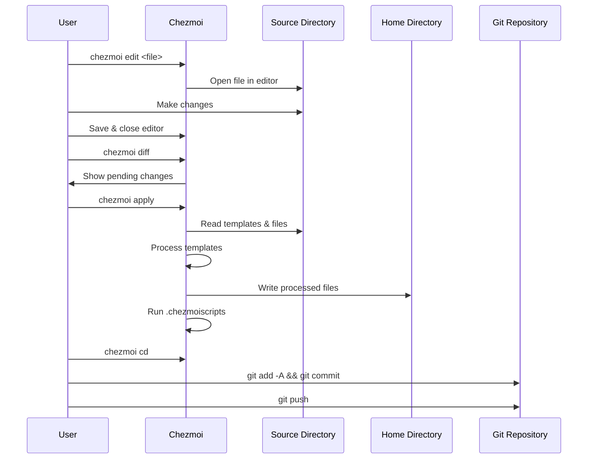

# 🛠️ Dotfiles Managed by chezmoi

This repository contains my personal dotfiles, managed using [chezmoi](https://www.chezmoi.io/) to ensure a consistent and secure developer environment across machines. It includes configurations for tools like Neovim, Ghostty, and Starship, along with automated setup scripts for a complete cloud/DevOps-focused development environment.

## 🚀 Getting Started

To set up this environment on a new machine:

1. **Install chezmoi**

   ```bash
   brew install chezmoi
   ```

2. **Initialize chezmoi**

   Start by cloning this repo using chezmoi:

   ```bash
   chezmoi init https://github.com/<USERNAME>/dotfiles
   ```

3. **Configure personal values**

   Edit the config file:

   ```bash
   chezmoi edit-config
   ```

   Below is the structure (YAML) of the configuration, these fields are required:

   ```yaml
   data:
      type: personal # set to either `work` or `personal` to tailor the installation
      hostname: my-hostname
      git: # Used for ~/.gitconfig
         email: <name@email.com>
         name: <First Last>
         signingKey: 1234ABC567DEF
   ```

   You can also configure default behaviors (edit, Git, etc.) as so:

   ```yaml
   edit:
      command: nvim

   git:
      autoCommit: true
      autoPush: true
   ```

   For more information please see the official [Chezmoi docs](https://www.chezmoi.io/reference/).

4. **Apply the configuration and initialize shell environment**

   ```bash
   chezmoi apply
   ```

   > 🔧 The `chezmoi apply` command applies all the dotfiles from the repository, runs automated setup scripts from `.chezmoiscripts/`, installs packages defined in `.chezmoidata/`, sets up your shell environment, and configures system defaults. It's the one-stop bootstrap script for your setup.

## 🏗️ Architecture & Workflows

### Chezmoi Workflow


### Package Installation Flow


### Configuration Management Lifecycle


### File Processing Pipeline
```mermaid
graph TD
    A[Source File<br/>dot_config/nvim/init.lua] --> B{Has .tmpl suffix?}
    B -->|Yes| C[Process Go Template]
    B -->|No| D[Copy As-Is]
    
    C --> E[Replace Variables<br/>{{ .email }}, {{ .name }}]
    E --> F[Apply Prefix Rules]
    D --> F
    
    F --> G{File Prefix}
    G -->|dot_| H[Replace with .]
    G -->|private_| I[Set 0600 permissions]
    G -->|executable_| J[Set executable bit]
    G -->|empty_| K[Create empty file]
    
    H --> L[Write to ~/.config/nvim/init.lua]
    I --> L
    J --> L
    K --> L
    
    style A fill:#f9f9e9
    style C fill:#e9f9e9
    style L fill:#e9e9f9
```

## 📁 Repository Structure

- **`dot_config/`**: Application configurations (Neovim, Ghostty, Starship, etc.)
- **`.chezmoiscripts/`**: Automated setup scripts that run during `chezmoi apply`
  - Package installation (Homebrew, Krew, pipx, Go tools)
  - System defaults configuration
  - Development environment setup (oh-my-zsh, k3d, atuin, etc.)
- **`.chezmoidata/`**: Configuration data files (YAML format)
  - `packages.yaml`: Package management configuration
    - `taps`: Homebrew third-party repositories
    - `brews`: Categorized Homebrew packages (base_tools, dev_languages, k8s_and_cloud, etc.)
    - `casks`: GUI applications and fonts
    - `vscode_extensions`: VS Code extension IDs
    - `python_packages`: Python tools with versions and optional extras
    - `go_tools`: Go packages with import paths and versions
  - `krew.yaml`: kubectl plugins
    - Lists plugins with supported architectures (amd64, arm64)
  - `helm.yaml`: Helm configuration
    - `repositories`: Chart repository URLs
    - `plugins`: Helm plugins with versions
- **`private_dot_*`**: Files with restricted permissions (GPG, SSH keys, API keys, login credentials, etc.)

## 🔐 Sensitive Configs & Password Manager Integration

Certain files, such as `.aws/config`, are managed via 1Password or Bitwarden and templated using chezmoi's template functions. These secrets are not stored in plaintext or committed to this repo. Ensure that you have the appropriate CLI (`op` for 1Password or `bw` for Bitwarden) installed and authenticated before running `chezmoi apply`.

## 🧼 Environment Classes

You can toggle between `work` and `personal` setups by updating the `type` value in your chezmoi config. This influences:

- Which tools are installed (e.g., `defenseunicorns/tap` for work)
- Git signing keys and credential managers
- Cloud and infra tools included

## 🛠️ Included Tools & Configurations

### Development Environment
- **Shell**: Zsh with Oh-My-Zsh, Starship prompt, zoxide, fzf
- **Editor**: Neovim (Kickstart.nvim with LSP, treesitter, debugging)
- **Terminals**: Ghostty with custom configuration
- **Version Control**: Git with GPG signing, delta for diffs
- **Programming Languages**: 
  - Go with development tools (gopls, goimports, godoc, gorename)
  - Python with pipx for isolated package installations
  - Node.js for JavaScript/TypeScript development

### Cloud & DevOps Tools
- **Cloud Providers**: AWS CLI, Azure CLI, Google Cloud SDK
- **Kubernetes**: kubectl, k9s, k3d, kind, krew plugins, Helm
- **Infrastructure**: Terraform, Ansible, Packer
- **Containers**: Docker, Podman, Tilt
- **Security**: SOPS, Cosign, Grype

### Modern CLI Replacements
- `bat` → `cat` (with syntax highlighting)
- `eza` → `ls` (with icons and git integration)
- `ripgrep` → `grep` (faster search)
- `fd` → `find` (user-friendly find)
- `zoxide` → `cd` (smarter directory navigation)

---

## 📎 Tips

- **Password Manager Integration**:
  - **1Password**: Ensure `op` CLI is installed and run `eval $(op signin)`
  - **Bitwarden**: Install the [Bitwarden CLI](https://bitwarden.com/help/cli/)
    - `bw login`
    - `bw unlock`
    - `export BW_SESSION=...`
- **Update configs**: Use `chezmoi diff` to preview, `chezmoi edit` to modify, and `chezmoi apply` to apply changes
- **Add new files**: Use `chezmoi add <file>` to start managing a file with chezmoi
- **Debugging**: Run scripts manually from `.chezmoiscripts/` to troubleshoot issues
- **Adding packages**: Edit the appropriate file in `.chezmoidata/`:
  - **Homebrew packages**: Add to `packages.yaml` under the appropriate `brews` category
  - **Go tools**: Add to `packages.yaml` under `go_tools` with full import path and version
  - **Python packages**: Add to `packages.yaml` under `python_packages` with name, version, and optional extras
  - **kubectl plugins**: Add to `krew.yaml` with name and supported architectures
  - **Helm repos/plugins**: Add to `helm.yaml` under repositories or plugins